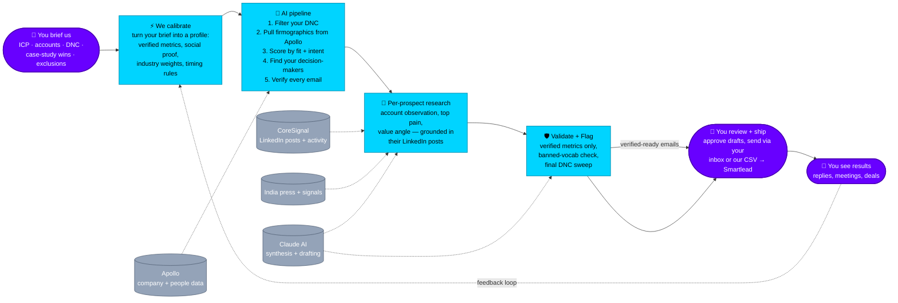

# ThyLeads — Outbound Engine Flow Diagram (Hero Section)

**For:** Figma hero-section animation on thyleads.com
**Audience:** Future clients (founders, heads of growth, sales leaders) deciding whether to sign up.
**Goal:** In 8 seconds, show *what you give us, what we do with it, and what you get back* — with control points clearly marked as YOURS.

---

## One-line pitch

> **"Tell us your ICP. We'll deliver you verified-ready emails — every line backed by research from your prospect's own LinkedIn."**

---

## The story (client perspective, 3 acts)

| Act | You do | We do |
|---|---|---|
| **Act 1 — Brief us** | Share your ICP, your exclusions, your case-study wins | We turn it into a calibration profile (audited every quarter) |
| **Act 2 — We work** | Wait ~5 minutes per pilot batch | 8-stage AI pipeline researches every prospect to the LinkedIn-post level |
| **Act 3 — You ship** | Review verified-ready emails, approve, send | We hand off the data + drafts; you keep the relationship |

---

## Visual layout (recommended)

**Orientation:** left-to-right horizontal flow, two horizontal swim lanes. Client lane on top, ThyLeads lane below.

```
   ┌────────────── YOUR LANE (the client — strategic input + final approval) ──────────┐
   │                                                                                     │
   │   1. You brief us         5. You review + ship                                      │
   │   (ICP, accounts,         (verified-ready emails        7. You see results          │
   │    DNC, wins)              delivered to your inbox)        (replies, meetings)      │
   │                                                                                     │
   ├──────────────── data flows DOWN to us, drafts come BACK to you ───────────────────┤
   │                                                                                     │
   │   2. We calibrate    →   3. AI pipeline runs   →   4. We validate and flag         │
   │                            (8 stages, ~5 min)        (rejected / shippable)         │
   │                                                                                     │
   │                                                          6. We feed results →      │
   │                                                          back into calibration       │
   │                                                                                     │
   └────────────────── ↑ feedback loop refines every future run ↑ ──────────────────────┘
```

**Swim-lane colors (recommended):**

| Lane | Hex | Mood |
|---|---|---|
| **You** (the client) | `#6800FF` (violet — your brand purple) | Strategic, in control |
| **ThyLeads** (the engine) | `#00D4FF` (cyan) | Active, computational |
| **Data sources we plug into** (Apollo / CoreSignal / LinkedIn / Claude AI) | `#94A3B8` (slate) | Credible plumbing |
| **Quality gates** | `#F59E0B` (amber) | "We catch this so you don't have to" |
| **Verified-ready output** | `#10B981` (emerald) | "Yours to send" |

---

## Mermaid diagram (paste into a Mermaid renderer to mock up)



---

## Stage-by-stage spec (client-facing labels)

### 🟣 What YOU do (3 nodes)

| # | Title (in node) | Subtitle (1 line) | Side-callout |
|---|---|---|---|
| **Y1** | **You brief us** | Your ICP, target accounts, DNC list, case-study wins | "5-minute setup. We do the rest." |
| **Y2** | **You review + ship** | Approve verified-ready emails, send via your inbox or our Smartlead export | "Every line traceable to a real research signal" |
| **Y3** | **You see results** | Replies, meetings, deals — measured per cohort | "Outcomes feed back into your next run" |

### 🔵 What WE do (4 nodes — collapse internal phases for marketing clarity)

| # | Title | What it covers internally | Why a client cares |
|---|---|---|---|
| **T1** | **We calibrate** | Turn brief into ICP rules, verified-metric whitelist, social-proof library, fiscal-calendar timing | *"Your brand never gets generic AI slop"* |
| **T2** | **AI pipeline** | Ingest → Filter (DNC, sister-brands) → Apollo enrich (strict primary_domain match) → Score → Decision-maker discovery → Email match | *"~5 min per batch. Hundreds of accounts processed in parallel"* |
| **T3** | **Per-prospect research** | Account-level observation/pain/value angle (Claude + Tavily + CoreSignal). Per-lead personalization grounded in actual LinkedIn posts (Haiku + CoreSignal multi-source) | *"Every email opens with something the prospect actually said"* |
| **T4** | **Validate + Flag** | 12+ rule checks: banned vocab, verified-metric whitelist, final DNC/active-customer sweep, cross-pollination guard | *"You only see emails that pass every check"* |

### 🟠 Quality gates (visual amber badges over T2–T4)

These are the trust badges. Show them as small amber pills on the relevant ThyLeads nodes:

| Gate | What it blocks |
|---|---|
| **Strict company match** | "libas.in" never returns leads from "libaas.in" |
| **Verified-metric whitelist** | Only your customer-validated metrics may be quoted in your emails |
| **Banned subject vocab** | Generic terms ("CRO", "experimentation", competitor brand names) auto-stripped |
| **Final DNC sweep** | DNC list checked again at the last gate before delivery |
| **Cross-pollination guard** | A prospect on a domain matching your social-proof library gets auto-rejected |

---

## Hero-section copy variants

Pick one for the headline above the diagram:

### Option A — outcome-led
> **Outbound that earns the click.**
> Every line in every email comes from research on your prospect — not generic AI templates. You ship. You own the relationship.

### Option B — proof-led
> **Per-prospect research, post-level depth.**
> Apollo for firmographics. LinkedIn posts for personalization. Claude AI for synthesis. You for the final yes.

### Option C — control-led
> **You set the rules. We do the research. You ship.**
> No generic AI slop. No DNC slips. No fake metrics. Every email passes 12+ checks before it reaches you.

### Option D — promise-led
> **Tell us your ICP. We'll deliver verified-ready emails.**
> Backed by research from your prospect's own LinkedIn. Validated against your DNC, your verified metrics, your case-study wins. Approved by you before send.

---

## Below-fold supporting blocks (recommended)

If the hero animation is the headline, these three blocks should sit directly below:

### Block 1 — "What you put in"
- Your ICP (industries, sizes, geos)
- Your DNC list + active customers
- Your case-study wins (with verified metrics)
- Your exclusions (sister brands, competitors)

### Block 2 — "What we do for you"
- Pull firmographics from Apollo (strict company-match — no adjacent-org leaks)
- Find decision-makers per account (verified by primary domain)
- Pull each person's actual LinkedIn activity from CoreSignal multi-source
- Synthesize per-account research (Claude Sonnet) and per-lead personalization (Claude Haiku)
- Run 12+ validation rules — banned vocab, verified-metric whitelist, final DNC sweep

### Block 3 — "What you get"
- Verified-ready emails with full research traceback per line
- Smartlead-compatible CSV export OR copy/paste mode
- Diagnostic panel per lead — see exactly which signals drove the personalization
- Quarterly audit cycle so your calibration stays sharp

---

## Animation suggestion (for Figma → Lottie / GIF)

**Loop:** 6 seconds total. The viewer should see THREE moments: input, work, output.

| Time | Action | What the viewer feels |
|---|---|---|
| 0.0–1.0s | **Y1 glows violet** — "You brief us" pulses with brief icons (ICP, DNC, accounts) | "I can do this — 5 min" |
| 1.0–2.5s | **T1 → T4 pulse cyan in sequence**, data-source nodes flicker as they're consulted | "Wow, they're actually using real data" |
| 2.5–3.5s | **Amber gate badges flash on T4** — emails get rejected/passed | "They reject their own work — that's trust" |
| 3.5–5.0s | **Y2 lights up violet** — verified emails arrive at you, emerald checkmark | "I get to approve — I'm in control" |
| 5.0–6.0s | **Y3 → T1 dotted feedback line glows** — replies feed back into calibration | "It gets smarter the more I use it" |

---

## Component inventory for Figma

If you want to build the components from scratch:

| Component | Description | Variants |
|---|---|---|
| **ClientNode** | rounded rect, violet fill, white text, 👤 icon | active / idle / glowing |
| **ThyLeadsNode** | rounded rect, cyan fill, dark text, ⚡/🤖/🧠/🛡️ icon, sub-line | active / idle |
| **DataNode** | cylinder shape (database icon), slate fill | always idle |
| **GateBadge** | amber pill, 12px, sits on ThyLeads node corner with checkmark icon | tooltip on hover |
| **ResultBadge** | emerald pill, "Verified-ready" label | static |
| **Connector** | 1.5px line, arrow head; dashed for data, solid for flow | normal / glowing |

---

## What NOT to put in the hero

- **Internal phase numbers** ("Phase 8b", "V-VWO-3") — kills the marketing tone, signals you're talking to engineers
- **Specific model names** ("Claude Haiku 4.5") — replace with "Claude AI" or just "AI synthesis"
- **Cost language** ("Tier-A leads", "credit budget") — internal optimization detail
- **Tool names the client doesn't recognize** ("Tavily", "es_dsl filter") — replace with "press signals", "search"
- **The word "operator"** — that's *us* talking about *us*. Use "you" everywhere

---

## Defensible claims (what marketing can confidently say)

These are real, code-backed promises:

- ✅ **"Per-prospect research grounded in their actual LinkedIn activity"** — CoreSignal multi-source pulls posts, shares, comments
- ✅ **"Strict company verification — adjacent-name orgs auto-rejected"** — primary_domain exact match in both Apollo and CoreSignal flows
- ✅ **"DNC swept twice — at intake and at the final ship gate"** — Phase 2 + Phase 10 final-filter sweep
- ✅ **"Every email passes 12+ validation rules before reaching you"** — banned vocab, verified-metric whitelist, cross-pollination guard, no-fabricated-metrics, etc.
- ✅ **"You set the rules — we audit them quarterly"** — calibration tab + Gate I-3 quarterly review
- ✅ **"No fabricated metrics — only your customer-verified case-study numbers may be quoted"** — verified-metric whitelist (V-VWO-2) enforced in Phase 10
- ✅ **"Operator-in-the-loop, not autonomous"** — Gates I-1 (pre-launch), I-2 (post-campaign), I-3 (quarterly)

## Avoid (over-claims that aren't always true)

- ❌ **"Every lead has a LinkedIn post you can quote"** — only true when CoreSignal multi-source returns posts; depends on subscription tier and the prospect's posting frequency
- ❌ **"100% accurate matching"** — we reject loose matches but Apollo's data quality is the floor we sit on
- ❌ **"Fully autonomous"** — you ship Gates I-1 / I-2 / I-3 manually; that's a *feature*, not a bug

---

## File hand-off to Figma

1. Open Figma → New file → name it `ThyLeads – Hero Flow`.
2. Set frame to **1920×800px** (hero proportions, fits above-the-fold on most desktop screens).
3. Build the 4 components from the inventory: `ClientNode` (3 variants), `ThyLeadsNode` (4 variants), `DataNode`, `GateBadge`.
4. Drop in 7 main nodes (3 client + 4 thyleads) using the Mermaid block above as layout reference.
5. Drop in 4 data-source cylinders below the ThyLeads lane.
6. Apply swim-lane backgrounds: `#6800FF` at 5% opacity for top row, `#00D4FF` at 5% opacity for bottom row.
7. Add amber gate badges on T2 / T3 / T4 with hover-tooltips.
8. Add the emerald "Verified-ready" badge between T4 and Y2 (the deliverable moment).
9. Animate per the timeline above; export as MP4 / Lottie for web embed.

---

## Quick mental model the diagram should leave with the viewer

> **"I tell ThyLeads who I want to reach. They do the research using real LinkedIn data. They flag what's not ready. I approve and ship. The system gets smarter every cycle."**

That's it. Three actions. Two by you, one by the engine. No magic, no autonomy theatre, no generic AI slop.
